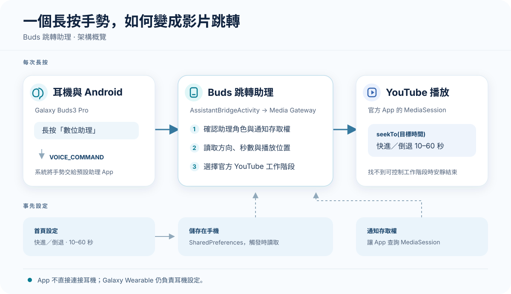

# Buds 跳轉助理

**長按 Galaxy Buds3 Pro，直接快進或倒退 YouTube 影片。**

想跳過或重看一小段影片時，不必拿起手機尋找播放進度。將 Buds3 Pro 的長按動作設為「數位助理」後，Buds 跳轉助理會把長按轉成 YouTube 影片跳轉。選好方向和秒數，之後使用時不必開啟 App。

```text
YouTube 播放一般影片 → 長按已設定的 Buds3 Pro → 快進或倒退 10～60 秒
```

## 主要功能

| 功能 | 說明 |
|---|---|
| 耳機長按跳轉 | 透過 Buds3 Pro 的數位助理長按動作控制影片進度 |
| 自訂方向與秒數 | 可選快進或倒退，每次跳轉 10、20、30、40、50 或 60 秒 |
| 設定後直接使用 | 設定會儲存在手機上，日常操作不必開啟 App |
| 專注官方 YouTube | 只尋找官方 YouTube App 可控制的播放工作階段 |
| 不直接連接耳機 | 耳機連線與長按設定仍由手機系統及 Galaxy Wearable 管理 |

## 下載與相容性

[下載最新正式版 APK](https://github.com/chengen1018/buds-jump-assistant/releases/latest/download/Buds-Jump-Assistant.apk)，在 Android 手機上開啟 APK 安裝。

| 項目 | 支援狀態 |
|---|---|
| Galaxy Buds3 Pro | 支援 |
| Android 16 以上 | 支援 |
| 官方 YouTube App 的一般影片 | 支援 |
| 背景播放或關閉螢幕 | YouTube 仍提供可控制的播放工作階段時可用 |
| YouTube Shorts、YouTube Music | 不支援 |
| Cast、廣告播放期間 | 不保證可用 |

## 快速開始

### 第一次設定

1. 連接 Galaxy Buds3 Pro，安裝並開啟 Buds 跳轉助理。
2. 依 App 提示開啟「通知存取權」，讓 App 能查詢 Android 的媒體播放工作階段。
3. 依 App 內導覽開啟手機「設定」，進入 Galaxy Buds3 Pro 的「耳機操控」→「長按操控選項」。
4. 將要使用的左側或右側耳機設為「數位助理」，點選旁邊的齒輪，選擇「Buds 跳轉助理」。可設定一側或兩側。
5. 回到 App 首頁，選擇快進或倒退及每次跳轉的秒數；設定會立即儲存。

**左右耳共用同一組設定。** 若兩側都設為數位助理，兩側會執行相同的跳轉方向與秒數，無法分別設定左耳倒退、右耳快進。

### 設定完成後

1. 在官方 YouTube App 播放一般影片。
2. 長按已設定的 Buds3 Pro 耳機。
3. 影片依 App 中的方向與秒數跳轉。

想停用時，可在耳機設定中把長按動作改回原本的功能。

## 疑難排解

| 遇到的情況 | 請檢查 |
|---|---|
| 長按完全沒反應 | 該側耳機是否已設為「數位助理」，並選擇「Buds 跳轉助理」 |
| 有耳機提示音，但影片沒跳轉 | 是否正在官方 YouTube App 播放一般影片；提示音只代表系統收到手勢 |
| 一般影片仍無法跳轉 | 「通知存取權」是否仍開啟，以及 YouTube 是否提供可控制的播放工作階段 |
| Shorts 或 YouTube Music 沒作用 | 這兩種內容不在支援範圍內 |
| 背景播放沒作用 | YouTube 在背景或關閉螢幕時仍須提供可控制的播放工作階段 |

找不到可安全控制的播放工作階段時，App 會結束這次操作，不顯示錯誤畫面。

## 技術原理



長按動作先由 Android 交給預設數位助理。App 收到 `VOICE_COMMAND` 後，讀取儲存的跳轉設定，從 Android 的 `MediaSession` 找到官方 YouTube App 可跳轉的播放工作階段，再呼叫 `seekTo()` 移動播放位置。App 不直接連接 Buds。

## 權限與隱私

| 系統存取或能力 | 是否需要 | 用途 |
|---|---|---|
| 通知存取權 | 需要 | 查詢目前可控制的媒體播放工作階段 |
| 數位助理角色 | 需要 | 接收 Buds 長按動作 |
| 藍牙權限 | 不需要 | App 不直接與 Buds 通訊 |
| 網路權限 | 不需要 | App 不需要自行連網 |
| 讀取通知內容 | 不使用 | App 不讀取或儲存通知內容 |

App 不收集分析資料；跳轉方向與秒數只儲存在手機上。

## 開發與建置

專案使用 Kotlin 與 Jetpack Compose。建置需要 JDK 21 和 Android SDK 37。執行單元測試、Lint 與 Debug 建置：

```bash
./gradlew :app:testDebugUnitTest :app:lintDebug :app:assembleDebug
```

Debug APK 位於 `app/build/outputs/apk/debug/app-debug.apk`，套件名稱為 `com.example.budscapabilityprobe.debug`，可與正式版同時安裝。正式版簽章方式見 [發布簽章說明](docs/release-signing.md)。
